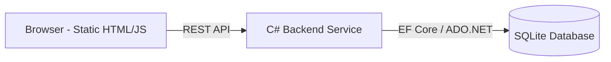

# System Design Document

> **Disclaimer**: This document is a draft assembled from initial requirements. Since the project details are not yet confirmed, many sections contain placeholders (TBD) or assumptions based on a standard personal project/MVP template.
> **Collection coverage**: 0% | **Confirmation progress**: 0%

## 1. Scope and Objectives

- **Project name**: TBD
- **Requirement name**: TBD
- **Background**: The project is in the initial discovery phase. No specific business problem has been defined yet.
- **Objective**: To build a functional demo/MVP based on the user's upcoming requirements using a lightweight, maintainable stack.

## 1.1 In Scope
- Core functional features (TBD).
- Web-based user interface.
- Local data persistence.
- Basic user authentication (if required).

### 1.2 Out of Scope
- High-concurrency optimizations.
- Microservices architecture.
- Multi-region deployment.
- Native mobile applications.

## 2. Personas and Actors

| Actor | Description |
| :--- | :--- |
| **End User** | Primary user interacting with the system to achieve [TBD goal]. |
| **Administrator** | (Assumption) User with elevated privileges to manage system data. |

## 3. System Use Cases

### UC-1: [Placeholder Use Case]
- **Actor**: End User
- **Trigger**: User navigates to the application.
- **Preconditions**: System is deployed and database is initialized.
- **Main flow**:
    1. User performs [Action A].
    2. System validates [Input].
    3. System updates [Database].
    4. System returns [Success Message].
- **Alternate/Exception flows**:
    - Invalid input: System returns 400 Bad Request.
- **Postconditions**: Data is persisted in SQLite.
- **Acceptance checks**: Verify data appears in the UI after refresh.

## 4. Functional Requirements

### 4.1 Feature Overview
TBD - Pending user input on core business logic.

### 4.2 Feature Details
- **Feature 1**: TBD
- **Feature 2**: TBD

### 4.3 Business Rules
- Rule 1: TBD
- Rule 2: TBD

## 5. Non-Functional Requirements

- **Performance**: Page load time < 2 seconds for local environments.
- **Scalability**: Support for single-user/small-group demo usage (Monolithic).
- **Availability**: Target 99% for demo purposes.
- **Portability**: Must run on any machine with .NET runtime and a browser.

## 6. High-Level Architecture

The system follows a **Simple Monolithic Architecture**:
- **Frontend**: Static HTML/CSS/Vanilla JavaScript. Communicates with the backend via Fetch API.
- **Backend**: C# (ASP.NET Core Minimal APIs or Web API).
- **Database**: SQLite (Local file-based storage).

## 7. Module Responsibilities

### 7.1 Candidate Modules
- **Web UI**: Handles presentation logic and user interactions.
- **API Layer**: Handles HTTP request routing, validation, and response formatting.
- **Domain Logic**: Contains the core business rules and services.
- **Data Access Layer**: Manages CRUD operations against the `app.db` SQLite file.

### 7.2 Page / Touchpoint Notes
- **Index.html**: Main dashboard/entry point.
- **Login.html**: (If required) Authentication interface.

## 8. API Design (Draft)

*Base URL: `/api/v1`*

| Endpoint | Method | Description | Payload (Draft) |
| :--- | :--- | :--- | :--- |
| `/items` | GET | Retrieve a list of items | N/A |
| `/items` | POST | Create a new record | `{ "name": "string", ... }` |
| `/items/{id}` | PUT | Update an existing record | `{ "name": "string", ... }` |
| `/items/{id}` | DELETE | Remove a record | N/A |

## 9. Data Model and Database Design

### 9.1 Candidate Tables (SQLite)

**Table: `Users`**
- `Id`: INTEGER (PK, Auto-increment)
- `Username`: TEXT (Unique, Indexed)
- `PasswordHash`: TEXT
- `CreatedAt`: DATETIME (Default: CURRENT_TIMESTAMP)

**Table: `Items` (Placeholder Entity)**
- `Id`: INTEGER (PK)
- `UserId`: INTEGER (FK -> Users.Id)
- `Title`: TEXT (Not Null)
- `Description`: TEXT
- `Status`: INTEGER (Default: 0)

### 9.2 Data Constraints
- Foreign key constraints enabled.
- Unique constraint on Usernames.
- Retention: Data persists in the local `app.db` file until manually deleted.

## 10. Key Workflows / Sequence Narratives

1. **Data Retrieval**: Frontend sends GET request -> C# Controller queries SQLite via EF Core -> Returns JSON -> JS populates DOM.
2. **Data Submission**: User submits form -> JS sends POST -> Backend validates -> SQLite inserts -> Backend returns 201 Created.

## 11. Security, Privacy, and Compliance

- **Authentication**: Basic Cookie-based auth or JWT (TBD).
- **Data Privacy**: No PII (Personally Identifiable Information) should be stored without encryption (Assumption).
- **Input Validation**: All API inputs sanitized to prevent SQL Injection (handled by parameterized queries in C#).

## 12. Observability and Operations

- **Logging**: Standard .NET `ILogger` outputting to Console and a local `log.txt` file.
- **Health Checks**: Simple `/health` endpoint returning 200 OK.

## 13. Deployment and Environment Plan

- **Environment**: Local Development (Windows/macOS/Linux).
- **Hosting**: Can be hosted on a simple VPS or run locally via `dotnet run`.
- **Database**: The `app.db` file is stored in the application root directory.

 14. Testing and Acceptance Plan

- **Unit Testing**: xUnit for backend logic.
- **Manual Testing**: Verification of UI flows in Chrome/Edge.
- **Acceptance Criteria**: All "In Scope" features must be reachable via the UI and persist data across restarts.

## 15. Risks, Trade-offs, and Assumptions

- **Assumption**: This is a single-user demo; no complex concurrency handling is implemented.
- **Trade-off**: SQLite is used for simplicity over a managed SQL Server/PostgreSQL instance.
- **Risk**: Lack of frontend framework (React/Vue) may make complex UI state management difficult if the scope grows.

## 16. Milestones and Delivery Plan

1. **Phase 1**: Project Setup & Database Schema (TBD)
2. **Phase 2**: Core API Development (TBD)
3. **Phase 3**: Frontend Integration (TBD)
4. **Phase 4**: Final Demo & Handover (TBD)

## 17. Open Questions / Missing Inputs

- **Core Problem**: What is the specific business problem or user need?
- **Scope**: What are the specific boundaries and out-of-scope items?
- **Users**: Who are the primary users?
- **Scenarios**: In what specific situations will users interact with this product?
- **Features**: What specific capabilities (e.g., reporting, data entry, automation) are required?